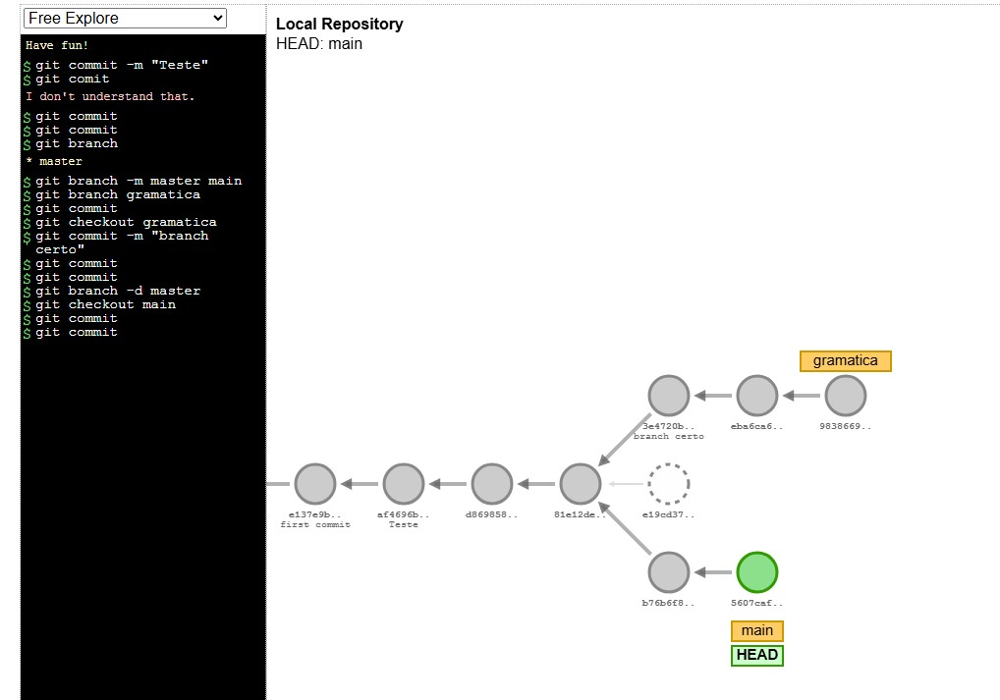

<!-- 
# Título  

## Descrição
O que faz o app
Com o que ele foi construído 
Por que foi construído

## Pré requisitos
  instalaçao node, git...

## Instrução de instalação
```bash
  npm install
```

## Instrução de uso
  Como utilizar o projeto em passos ou em bash. Podemos usar prints ou gifs

## Licença

### Permissão para uso comercial
### se inspirar
### Educacional
### Não comercial

## Contribuição

## Gitflow 
Quais padrões os dev podem seguir para contribuir

## badges

[](./LICENSE) <br>
https://github.com/Ileriayo/markdown-badges/blob/master/README.md

## Contruibuidores  ou Owner (donos do projeto)
  reconhecimentos

Podemos usar templates de README
https://github.com/Fernanda-Kipper/Readme-Templates?tab=readme-ov-file 
-->

# [Curso Git e GitHub: dominando controle de versão de código - Alura](https://cursos.alura.com.br/course/git-github-dominando-controle-versao-codigo)


## Descrição
Anotações das aulas e comandos relevantes.

## Pré requisitos
  * git
  * github

## Comandos 

### Status dos Commits

Comandos               | Descrição
---------              | ------
git log --oneline      | Para ver somente os títulos e hashs dos commits
git log -p             | Exibe em formato diff as alterações dos commits --- linhas removidas e +++ linhas adicionadas -p. Para visualizar as alterações em cada arquivo modificado;
git status | Qual branch estamos e se tem alterações para comitar
git diff | Mostra a diferença entre o último commit e as alterações feitas (não comitadas)

Posso comparar um commit específico com outro.

`git diff {hashcommit}..{hashcommit}`

*compara só as alterações que não adicionei para o commit ainda. 

Se informarmos apenas uma hash específica ele compara esse hash com o último comitado por padrão.


### Status dos Commits - menos usados
Comandos               | Descrição
---------              | ------
git log --graph        | Mostra a linha do tempo dos commits
git log -- pretty ou git log --format 
git log --help         | Abre o manual do git, podemos procurar pelos formats no arquivo.
git show {hash do commit} | É o git log -p para o commit específico -> mostra as alterações
git show | Sem a hash o default será o HEAD, mostra os detalhes do último commit

> HEAD é o commit mais recente da branch atual

### Branch

Comandos                 | Descrição
---------                | ------
git branch               | Mostra as ramificações existentes no projeto
git branch nomebranch    | Criar uma nova branch
git branch -m nomeatual novonome | Renomeia a branch
git branch -d nomebranch | Remover a branch
git checkout* nomebranch  | Modifica a branch atual para a branch informada
git checkout -b nomenovabranch | Cria nova branch e alterna para ela = b de branch
git switch -c nomenovabranch | Cria nova branch e alterna para ela = c de create (mais atual)

*checkout é um comando antigo, atualmente é utilizado o git switch
*posso unir dois comando em um só

### Anotações

Branch/Ramificação

Para visualizar como as branchs funcionam
https://git-school.github.io/visualizing-git/



A branch padrão é a Main (antigamente se chamava Master)

Ao criar uma novra branch preciso modificar a branch atual para essa nova

## Licença
[](./LICENSE) 
