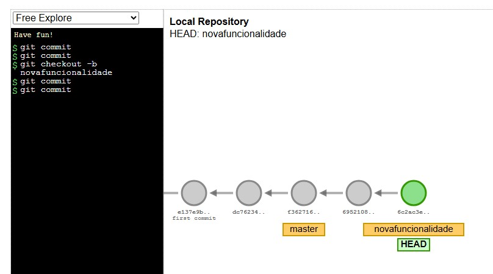
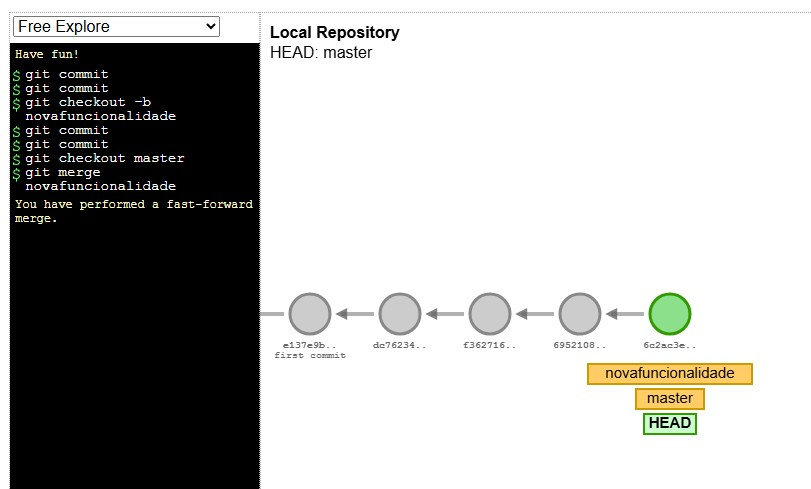
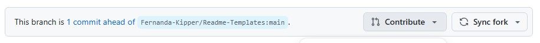
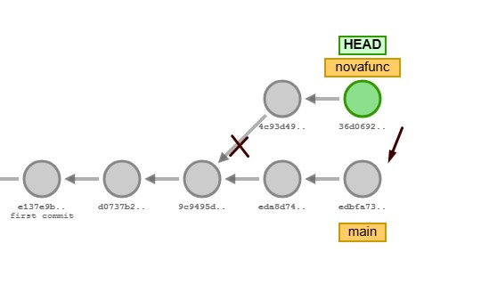
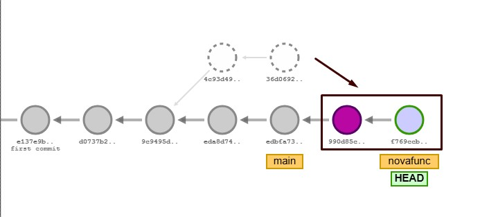

# [Curso Git e GitHub: dominando controle de versão de código - Alura](https://cursos.alura.com.br/course/git-github-dominando-controle-versao-codigo)


## Descrição
Anotações das aulas e comandos relevantes.

## Pré requisitos
  * git
  * github

## Comandos 

### Status dos Commits

Comandos               | Descrição
---------              | ------
git log --oneline      | Para ver somente os títulos e hashs dos commits
git log -p             | Exibe em formato diff as alterações dos commits --- linhas removidas e +++ linhas adicionadas -p. Para visualizar as alterações em cada arquivo modificado;
git status | Qual branch estamos e se tem alterações para comitar
git diff | Mostra a diferença entre o último commit e as alterações feitas (não comitadas)

Posso comparar um commit específico com outro.

`git diff {hashcommit}..{hashcommit}`

*compara só as alterações que não adicionei para o commit ainda. 

Se informarmos apenas uma hash específica ele compara esse hash com o último comitado por padrão.


### Status dos Commits - menos usados
Comandos               | Descrição
---------              | ------
git log --graph        | Mostra a linha do tempo dos commits
git log -- pretty ou git log --format 
git log --help         | Abre o manual do git, podemos procurar pelos formats no arquivo.
git show {hash do commit} | É o git log -p para o commit específico -> mostra as alterações
git show | Sem a hash o default será o HEAD, mostra os detalhes do último commit

> HEAD é o commit mais recente da branch atual

### Branch

Comandos                 | Descrição
---------                | ------
git branch               | Mostra as ramificações existentes no projeto
git branch nomebranch    | Criar uma nova branch
git branch -m nomeatual novonome | Renomeia a branch
git branch -d nomebranch | Remover a branch
git checkout nomebranch  | Modifica a branch atual para a branch informada
git checkout -b nomenovabranch | Cria nova branch e alterna para ela = b de branch
git switch -c nomenovabranch | Cria nova branch e alterna para ela = c de create (mais atual)
git switch nomedabranch | Volta para branch desejada
git push origin novabranch | push na branch desejada

*checkout é um comando antigo, atualmente é utilizado o git switch
*posso unir dois comando em um só

### Unir ou Remover Branch

Comandos                 | Descrição
---------                | ------
git merge novabranch     | Uni a branch atual com a branch informada
git branch -d branchobsoleta | Remove branch no repositório local
git push origin :branchobsoleta | Remove a branch no repositório remoto

#### Antes da unir as branchs (merge)


#### Depois de unir as branchs

*mudar para branch master e unir com a atual



Isso é o fast-foward (move adiante)

>commit merge:

Ao unir branch com estados diferentes (alterações diferentes), eles vai comitar as diferenças, posso dar push e depois deletar a branch não mais utilizada

#### Branch

Branch/Ramificação

Para visualizar como as branchs funcionam
https://git-school.github.io/visualizing-git/


A branch padrão é a Main (antigamente se chamava Master)

Ao criar uma nova branch preciso modificar a branch atual para essa nova

Normalmente, a branch main é o projeto final que irá para produção

#### Pull request

  Um Fork é um cópia de um repositório para nossa conta

  Ao clonar o fork e fazer o git push na branch, o seguinte aviso é dado no repositório do github

  ```This branch is 1 commit ahead of Fernanda-Kipper/Readme-Templates:main.```

  

  Podemos contribuir e abrir um pull request

#### Atualizando a branch (Reescrevendo a branch)

A main pode ter recebido outros commits de outros colaborados. 
Criamos a branch novafunc após a main já ser atualizada. 
No entanto, quero que a branch seja recriada em cima da versão mais atual na main.
Quero que meus commits fiquem depois da main atualizada.
Para isso podemos usar o comando
`git rebase`




Comandos                 | Descrição
---------                | ------
git rebase nomebranch              | Reescreve a branch depois da main atualizada

Após o `git rebase main`


Observe que ao realocar commit a commit na main atualizado, ele commit novamente essas alterações, por isso as hash são diferentes ao inserir-las na main.

* Preciso dar o push origin main e push origin novafunc, para atualizar as duas branchs.
* Após isso posso dar o merge em novafunc para main. para unir as duas branchs, como já fiz o rebase não dá o commit de merge. 
* Posteriormente, dou git push origin main.

Quando os merge precisam de fast-foward (tudo alinhado, sem ramificação), significa que precisa ser feito o git rebase antes do git merge.


#### Diferença entre **git merge** x **git rebase**
O rebase uni a branch que estou trabalhando para a main, somando meus commit depois da main atualizada. Deixa tudo na mesma linha do tempo.
Já o merge mistura/mescla as branchs, no qual, preciso revisar os conflitos.

O merge junta os trabalhos de duas branches, podendo gerar um merge commit. Já o rebase aplica os commits de outra branch na branch atual.


### Interromper projeto

Quando estou no meio da criação de uma nova funcionalidade e preciso parar esse desenvolvimento por algum motivo.
Preciso engavetar essa alteração, sem criar um commit, para alterar outra parte do código. Posteriormente recupera-la e depois comitar.

Para isso podemos usar o comando `git stash`

As alterações não aparecem no arquivo, para traze-las de volta usamos o comando `git stash pop`

Comandos                 | Descrição
---------                | ------
git stash | Guarda uma alteração para continuar nela depois
git stash pop | Trás as alterações que foram pausadas
git stash list | Mostra as alterações engavetados
git stash drop | Remove um único item do stash list
git stash clear | Limpa as stash/ as alterações engavetadas
git stash push -m "texto" | stash com nome específico
git stash apply índice | para voltar para um índice específico do stash list

o `git stash list` mostra wip (working in progress) on nomedabranch (branch que estávamos) último commit 
Não é mt descritivo.
Podemos apagar o git stash com `git stash clear`
E adicionar a git stash com nome mais específico/descritivo

Ao fazer mais de uma stash, ele vai armazenando na lista. Podemos ver essa lista com o `git stash list` . Cada stash é adicionada em uma pilha. Ao dar o git stash pop ele retorna o último da pilha, que é o índice 0. Para voltar à um stash específico usamos o git stash apply nº (número do índice que vemos no git stash list)

O git stash apply não remove o stash da lista, já o git stash pop remove aquela stash da list.
Podemos dar `git stash apply nºindice` ou `git stash pop nºindice`

O git stash drop remove o último item da lista de stash sem aplicar as alterações no repositório. Enquanto o git stash drop 1 remove da stash o item com índice 1.

### Restaurar/ Voltar para o último commit

Podemos voltar para o último commit, descartando as alteraçõs feitas não commitadas nem adicionadas

Comandos                 | Descrição
---------                | ------
git restore . | Restauro para o último commit. Descarta todos os arquivos não commitados do projeto. 
git restore | Restaura o index.html . Descarta as alterações nesse arquivo

git checkout -- . tinha a função do git restore, porém é um comando antigo

Podemos modificar arquivos não adicionados para commit, nossa Working tree - árvore de trabalho

### Restore staged

Após adicionar um arquivo, antes de commitar, ficamos no staged area/estado pronto para ser comitado.
Podemos desfazer esse add com `git restore --staged`
Podemos voltar um add específico com `git restore --staged index.html` por exemplo.

Podemos mover um arquivo para um estado/commit anterior com `git restore --source=cógidodocommit nomearquivo`

Exemplo: `git restore --source=ceb836bb75633cb3de5d28ef92633fff08be4f85 index.html`
Após esse comando, ainda podemos voltar para o estado anterior, antes do restore source, com o `git restore index.html` ou `git restore --source=HEAD index.html`

Movemos a index.html para como ela era naquele commit.

Comandos                 | Descrição
---------                | ------
git restore --staged | Remove o arquivo do commit
git restore --staged index.html | Remove o arquivo, no caso index.html, do commit
git restore --source=códigodocommit nomearquivo | Move um arquivo para o estado que era naquele commit
git restore nomearquivo ou git restore --source=HEAD nomearquivo | move o arquivo para o estado atual

Podemos manipular o Staging Area, modificar arquivos adicionados.

### Criando versões

Posso dar um nome/save para um ponto da aplicação, no git chamamos isso de **tag**. Para ver as tags adicionados podemos dar o git log.

Comandos                 | Descrição
---------                | ------
git tag | Ve todas as tags.
git tag nomeversao | Cria uma tag na branch atual, no commit atual.
git tag nomeversao idCommit| Cria uma tag em um commit específico.
git push origin nomeversao | Envio a tag passada para o repositório remoto.
git push origin --tags | Envia todas as tags para o repositório remoto.
git tag -d nomedatag | Excluir a tag no repositório local
git tag -a nomedatag -m "Mensagem"| Cria uma annotaded tag com uma mensagem. O -a é opcional
git tag -v nomedatag | Verifica os dados da tag, só funciona com tags annotaded

git log --oneline

No gitbub, na parte de releases, consigo visualizar as tags ou apaga-las do repositório remoto.
Consigo criar descrições para as tags. São as Annotaded Tags.
Preciso dar o push das tags para o repositório remoto após criá-las no local.

### Releases

Disponibiliza a versão de uma forma mais detalhada.
Podemos criar no site do github, escolhendo uma tag. Podemos também gerar no github um release notes, que gera as alterações feitas nessa versão. Quando não tem alterações aparece o Full Changelog. Mostro o diff entra as versões existentes. Consigo inserir um arquivo também, como arquivos binários (projeto compilado), além disso o release cria automaticamente o projeto compilado em rar e tar.gz dessa forma o projeto fica disponível para pessoas que não utilizem git, elas também podem ter acesso ao código fonte pela release.

### Pegando um commit - git cherry-pick

Aproveitar um commit de uma branch em outra branch. Damos git log no commit em outra branch e copiamos o hash do commit que queremos trazer para essa branch. Após isso damos  `git cherry-pick hashCommit` para trazer para essa branch.

Podemos dar git push em duas branchs ao mesmo tempo: `git push origin branch1 branch2`

Comandos                 | Descrição
---------                | ------
git log nomebranch | Ve os logs da daquela branch.
git log nomebranch | Ve os logs da daquela branch.
git cherry-pick hashCommit| Busca aquele commit e traz para branch atual
git push origin branch1 branch2 | Dar git push em duas branchs ao mesmo tempo


## Licença
[](./LICENSE) 
